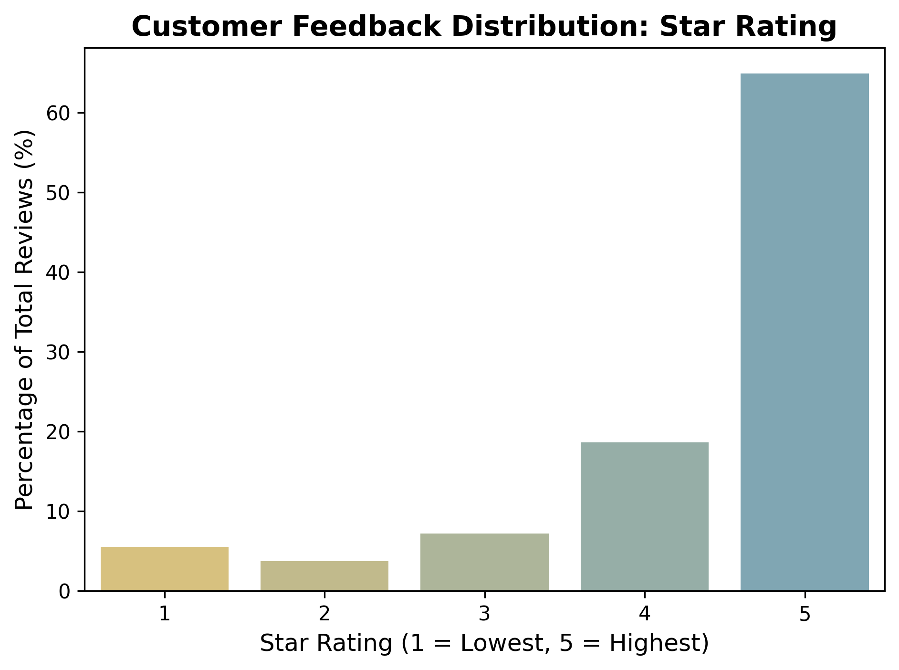
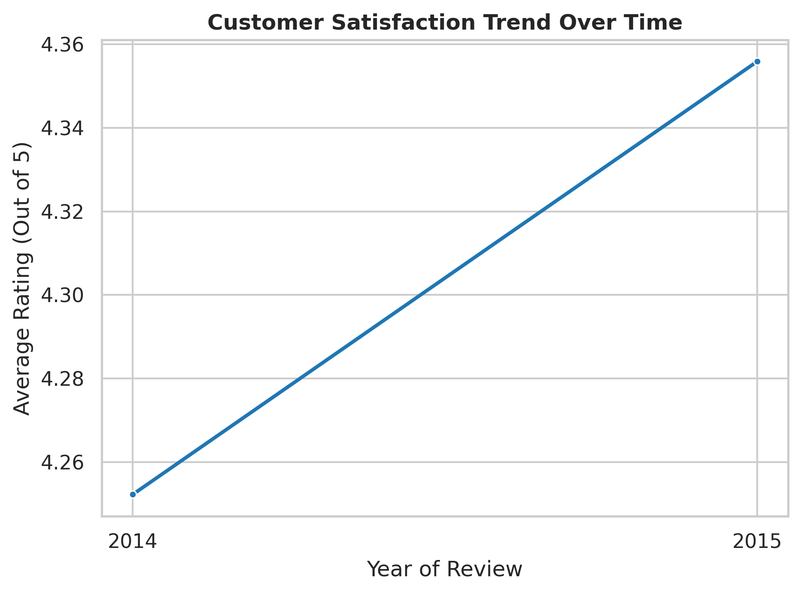

# Amazon Product Review Sentiment Analysis

### *Problem Statement*

With the rapid growth of e-commerce platforms like Amazon, millions of customer reviews are generated daily. Manually analyzing this huge volume of textual feedback is time-consuming and inefficient.

There is a need for an automated system that can:
- Understand customer opinions from review text
- Classify reviews into positive or negative sentiment
- Help businesses quickly identify product performance and customer satisfaction trends

This project aims to solve this problem by building a **machine learning-based sentiment analysis system** using Amazon product reviews.

---

### *Project Overview*
This project builds a **Sentiment Classification System** for Amazon product reviews using Python and Machine Learning.  
It processes **30,000+ reviews**, performs data cleaning, exploratory data analysis (EDA), feature engineering, and builds a **Logistic Regression model** achieving ~**87.6% accuracy**.

The goal is to analyze customer feedback and extract actionable business insights.

---

### *Objectives*
- Classify reviews into **Positive (1)** and **Negative (0)** sentiment
- Clean and preprocess raw text data for NLP modeling
- Analyze customer satisfaction trends
- Identify product performance patterns
- Build a machine learning classification model
- Visualize insights for business decision-making

---

### *Data Cleaning & Preprocessing*
The dataset was cleaned using Python and NLP techniques:

- Removed missing values from `review_headline` and `review_body`
- Converted text to lowercase
- Removed HTML tags and special characters
- Eliminated punctuation and noise using regex
- Applied whitespace normalization
- Created new feature: `cleaned_review`

---

### *Exploratory Data Analysis (EDA)*

#### Star Rating Distribution
- Most reviews are 4–5 star ratings
- Dataset is highly skewed towards positive reviews

#### Sentiment Distribution
- Positive (1): **83.54%**
- Negative (0): **16.46%**

#### Product Performance Analysis
- Highest-rated products identified using average star rating per product_id

#### Word Frequency Analysis
- **Positive reviews:** love, great, easy, use, tablet
- **Negative reviews:** device, apps, slow, issue, buy

#### Time Series Analysis
- Average rating trends analyzed using yearly review data

---

### *Machine Learning Model*

#### Model Details
- Algorithm: Logistic Regression
- Features: TF-IDF Vectorization (1–2 grams)
- Train-Test Split: 80/20
- Class balancing: `class_weight = balanced`

#### Performance
- Accuracy: **87.64%**

#### Evaluation Metrics
- Confusion Matrix:
  - True Negatives: 855
  - False Positives: 172
  - False Negatives: 590
  - True Positives: 4551

- Model performs well on identifying positive reviews with high precision and recall.

---

### *Visualizations*

#### Star Rating Distribution

#### Customer Satisfaction Trend

---

### *Key Insights*
- Majority of users are satisfied with products
- Positive reviews dominate dataset
- Tablet and Kindle-related products are highly reviewed
- Customer satisfaction remains stable over time with slight variation
- Review text strongly reflects sentiment polarity
